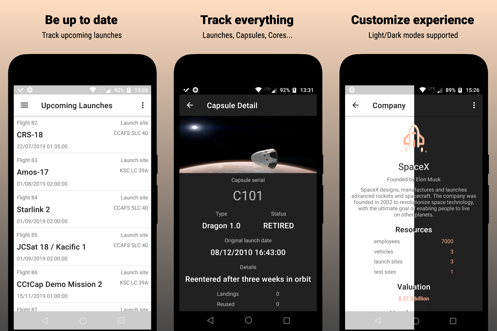
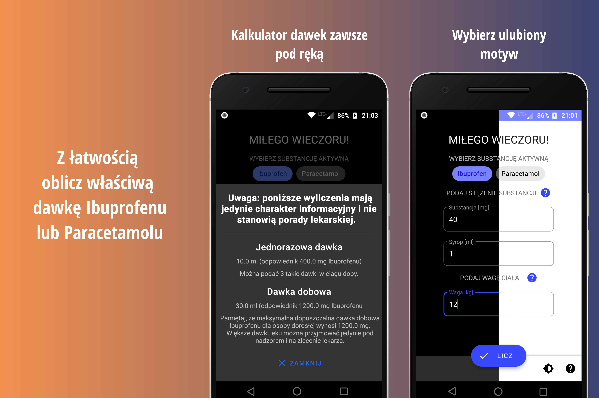

## Welcome!
You can find me at:
- [Twitter](https://twitter.com/omisie11) ✔️
- [GitHub](https://github.com/OMIsie11) ✔️

### SpaceX Follower
Android app for tracking missions, launches and being up-to-date with SpaceX activity.
Application is using **unofficial** open source [SpaceX Rest Api](https://github.com/r-spacex/SpaceX-API).

### [Dose Calculator (PL: Kalkulator Dawek)](https://github.com/OMIsie11/DoseCalculator)
Small and simple app for calculating doses of medicines (Ibuprofen and Paracetamol).
App based on web calculator that You can find [here](https://mamaistetoskop.pl/), originally made by [Mateusz Woźniak](https://github.com/wozniakm).
**All calculations are for informational purposes only and do not constitute medical advice.**
**Application was designed for Polish users. So it will probably be usefull only for them.**

PL: Prosta aplikacja do obliczania właściwych dawek Ibuprofenu i Paracetamolu. Bazuje na kalkulatorze znajdującym się na stronie [mamaistetoskop.pl](https://mamaistetoskop.pl/), którego twórcą jest [Mateusz Woźniak](https://github.com/wozniakm).
**Wszystkie wyliczenia mają wyłącznie charakter informacyjny i nie stanowią porady lekarskiej.**

Screenshots from Polish version of App.

### Coffee consumption and productivity tracker
Simple and clean Android app for tracking Your daily coffee consumption and productivity level.

